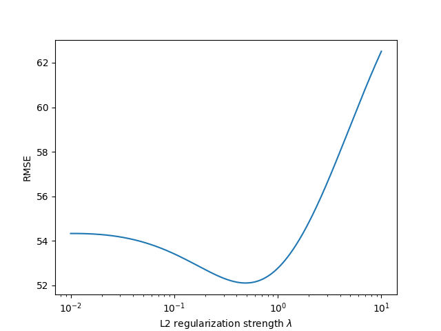
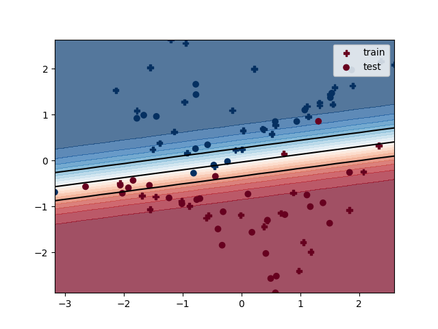
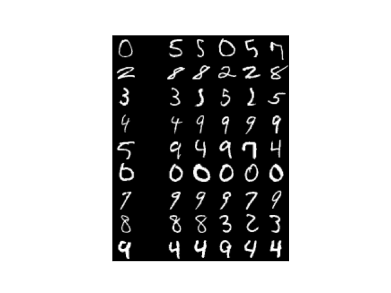

# Machine Learning Algorithms

This repository contains implementations of core machine learning algorithms, both from scratch and using scikit-learn, written in Python.
## Table of Contents
- [Linear regression](#linear-regression)
  - [Analytical solution](#analytical-solution)
  - [Stochastic gradient descent](#stochastic-gradient-descent)
  - [L2 regression](#l2-regression)
  - [Grid search](#grid-search)
- [Logistic regression](#logistic-regression)
  - [Stochastic gradient descent](#stochastic-gradient-descent-1)
  - [Grid search](#grid-search-1)
  - [Multinomial classification](#multinomial-classification)
  - [Multi-label classification](#multi-label-classification)
  - [Tf-Idf](#tf-idf)
- [Neural Networks](#neural-networks)
  - [Perceptron](#perceptron)
  - [Multilayer perceptron](#multilayer-perceptron)
  - [MNIST solver](#mnist-solver)
- [K-nearest neighbors](#k-nearest-neighbors)
- [Naive Bayes](#naive-bayes)
  - [1. Bayes’ Theorem](#1-bayes-theorem)
  - [2. Gaussian Naive Bayes](#2-gaussian-naive-bayes)
  - [3. Bernoulli Naive Bayes](#3-bernoulli-naive-bayes)
  - [4. Multinomial Naive Bayes](#4-multinomial-naive-bayes)
- [Trees](#trees)
  - [Decision Tree](#decision-tree)
  - [Random forest](#random-forest)
- [Gradient boosting](#gradient-boosting)
- [Principal Component Analysis (PCA)](#principal-component-analysis-pca)
- [K-Means](#k-means)
- [Model comparison](#model-comparison)
- [License and Attribution](#license-and-attribution)

# Linear regression

## Analytical solution
In [explicit_linear_regression.py](Linear%20Regression/explicit_linear_regression.py), I compute the analytical (closed-form) solution for the optimal model weights in linear regression.  
The optimal weights formula is obtained by setting the derivative of the **mean squared error (MSE)** loss function to zero, with respect to all weights:  
$\boldsymbol{w} = (X^\top X)^{-1} X^\top y$

**Example usage:**  
`python "Linear Regression/explicit_linear_regression.py" --test_size=0.1`  
**Example output:**  
`52.38`

## Stochastic gradient descent
In [linear_regression_sgd.py](Linear%20Regression/sgd_linear_regression.py), I approximate the optimal weights using mini-batch stochastic gradient descent (SGD) with L2 regularization. The loss function minimized is one-half of the mean squared error (error function). 

For a mini-batch of size \(B\), the **gradient** is:
$$\nabla_{\mathbf{w}} J = -\frac{1}{B} X_B^\top (\mathbf{y}_B - X_B \mathbf{w}) + \lambda \mathbf{w}$$  
And the SGD update rule:
$$\mathbf{w} \leftarrow \mathbf{w} - \eta \nabla_{\mathbf{w}} J$$

**Example usage:**  
`python "Linear Regression\sgd_linear_regression.py" --batch_size=10 --epochs=50 --learning_rate=0.01`  
**Example output:**  
```
Test RMSE: SGD 90.958, explicit 91.5
Learned weights: 3.944 7.517 0.084 30.820 -1.721 -1.129 -1.980 6.294 1.980 -10.597 -13.841 -4.312 ...
```

## L2 regression
In [ridge_regression.py](Linear%20Regression/l2_linear_regression.py), I evaluate Ridge Regression — a type of linear regression that adds an L2 regularization term to the loss function to prevent overfitting and improve model generalization. The model minimizes the following objective:  

$J(\mathbf{w}) = \|y - X\mathbf{w}\|^2 + \lambda \|\mathbf{w}\|^2$

It evaluates 500 different λ (lambda) values, geometrically spaced between 0.01 and 10, and returns the λ producing the lowest value and the corresponding value.

**Example usage:**  
`python "Linear Regression/l2_linear_regression.py" --test_size=0.15 --plot`  
**Example output:** 
`0.49 52.11`



## Grid search
In [linear_regression_comparison.py](Linear%20Regression/linear_regression_comparison.py), I evaluated multiple linear regression–based models. They are trained on h data from a bike rental shop.
### Implementation 
#### 1. **Feature Preprocessing**
- **Categorical columns:** automatically detected (integer-only columns) and one-hot encoded using `OneHotEncoder(handle_unknown="ignore")`.
- **Real-valued columns:** scaled using `StandardScaler` for zero mean and unit variance.
- Combined using `ColumnTransformer`.

#### 2. **Polynomial Feature Expansion**
Adds **2nd-order polynomial features** to capture non-linear relationships and feature interactions.

#### 3. **Model Comparison**
The following models from scikit-learn are trained and evaluated to find the one that minimizes the loss function. Cross-validation uses negative RMSE as the scoring metric.  
Additionally, I used `GridSearchCV` to find the best hyperparameters for each model.

| Model | Regularization | Parameters Tuned |
|--------|----------------|------------------|
| `LinearRegression` | None | – |
| `Ridge` | L2 | `alpha ∈ {10⁻³, 10⁻², 10⁻¹, 1}` |
| `Lasso` | L1 | `alpha ∈ {10⁻³, 10⁻², 10⁻¹, 1}` |
| `SGDRegressor` | L1 or L2 | `alpha`, `eta0`, `learning_rate`, `penalty`, `max_iter` |

#### 4. **Model Ranking and Ensemble**
- All models are scored by mean RMSE.
- Models are sorted by performance.
- The top 3 models are **ensembled** with weighted averaging:

**Example usage:**  
`python "Linear Regression/linear_regression_comparison.py"`
**Example output:**  
```
Training scores
1. Lasso RMSE = 66.4811
best params: {'alpha': 0.1}
2. SGDRegressor RMSE = 67.2270
best params: {'alpha': 0.1, 'eta0': 0.001, 'learning_rate': 'invscaling', 'loss': 'squared_error', 'max_iter': 7000, 'penalty': 'l1'}
3. Ridge RMSE = 75.0376
best params: {'alpha': 1.0}
4. LinearRegression RMSE = 215.5452
```

The RMSE for the training data was 64.76.

# Logistic regression

## Stochastic gradient descent
In [sgd_logistic_regression.py](Logistic%20Regression/sgd_logistic_regression.py), I train a logistic regression model using mini-batch stochastic gradient descent (SGD). 

The linear combination of inputs is passed through the **sigmoid function** to produce class probabilities between 0 and 1.  
The model minimizes the average MLE (maximum likelihood estimate), which is the same as minimizing the negative log likelihood (if we assume P follows a normal distribution). 
**Example usage:**  
`python "Logistic Regression/sgd_logistic_regression.py" --data_size=95 --test_size=45 --batch_size=5 --epochs=9 --learning_rate=0.5 --plot`  
**Example output:**  
```
After epoch 1: train loss 0.2429 acc 96.0%, test loss 0.3187 acc 93.3%
After epoch 2: train loss 0.1853 acc 96.0%, test loss 0.2724 acc 93.3%
After epoch 3: train loss 0.1590 acc 96.0%, test loss 0.2525 acc 93.3%
After epoch 4: train loss 0.1428 acc 96.0%, test loss 0.2411 acc 93.3%
After epoch 5: train loss 0.1313 acc 98.0%, test loss 0.2335 acc 93.3%
After epoch 6: train loss 0.1225 acc 96.0%, test loss 0.2258 acc 93.3%
After epoch 7: train loss 0.1159 acc 96.0%, test loss 0.2220 acc 93.3%
After epoch 8: train loss 0.1105 acc 96.0%, test loss 0.2187 acc 93.3%
After epoch 9: train loss 0.1061 acc 96.0%, test loss 0.2163 acc 93.3%
Learned weights -0.61 3.61 0.12
```


## Grid search 
In [grid_search_logistic_reg.py](Logistic%20Regression/grid_search_logistic_reg.py), I perform hyperparameter tuning for logistic regression using grid search, combined with stratified k-fold cross-validation. The model with the best found hyperparameters gets evaluated over the test data.  
Using StratifiedKFold ensures that each fold preserves the overall class distribution of the target variable, which is important for balanced evaluation in classification tasks.

Evaluated hyperparameter combinations:
- Polynomial degree: 1, 2  
- Regularization strength C: 0.01, 1, 100  
- Solver: lbfgs, sag

**Example usage:**  
`python "Logistic Regression/grid_search_logistic_reg.py" --test_size=0.5`  
**Example output:**  
```
Rank: 11 Cross-val: 86.7% log_reg__C: 0.01  log_reg__solver: lbfgs poly_features__degree: 1
Rank:  5 Cross-val: 92.7% log_reg__C: 0.01  log_reg__solver: lbfgs poly_features__degree: 2
Rank: 11 Cross-val: 86.7% log_reg__C: 0.01  log_reg__solver: sag   poly_features__degree: 1
Rank:  5 Cross-val: 92.7% log_reg__C: 0.01  log_reg__solver: sag   poly_features__degree: 2
Rank:  7 Cross-val: 91.0% log_reg__C: 1     log_reg__solver: lbfgs poly_features__degree: 1
Rank:  2 Cross-val: 96.8% log_reg__C: 1     log_reg__solver: lbfgs poly_features__degree: 2
Rank:  8 Cross-val: 90.8% log_reg__C: 1     log_reg__solver: sag   poly_features__degree: 1
Rank:  3 Cross-val: 96.8% log_reg__C: 1     log_reg__solver: sag   poly_features__degree: 2
Rank: 10 Cross-val: 90.1% log_reg__C: 100   log_reg__solver: lbfgs poly_features__degree: 1
Rank:  4 Cross-val: 96.4% log_reg__C: 100   log_reg__solver: lbfgs poly_features__degree: 2
Rank:  9 Cross-val: 90.5% log_reg__C: 100   log_reg__solver: sag   poly_features__degree: 1
Rank:  1 Cross-val: 97.0% log_reg__C: 100   log_reg__solver: sag   poly_features__degree: 2

Test accuracy: 98.11%
```
## Multinomial classification

In [sgd_multinomial_classification.py](Logistic%20Regression/sgd_multinomial_classification.py), I implement mini-batch SGD for multinomial (softmax) logistic regression on the digits dataset from scikit-learn.  
The model learns to classify handwritten digits by producing a probability distribution over 10 output classes using the softmax function. The loss function is the same as before.

**Example usage:**  
`python "Logistic Regression/sgd_multinomial_classification.py" --batch_size=10  --epochs=2 --learning_rate=0.005`  
**Example output:**   
```
After epoch 1: train loss 0.3130 acc 90.8%, test loss 0.3529 acc 88.7%
After epoch 2: train loss 0.2134 acc 93.9%, test loss 0.2450 acc 92.5%
Learned weights:
  -0.03 -0.10 0.01 0.06 -0.07 0.04 -0.05 0.05 0.07 -0.10 ...    
  0.09 0.08 -0.12 -0.08 -0.10 0.09 -0.03 -0.06 0.02 -0.01 ...   
  0.05 0.07 0.01 -0.03 -0.05 0.06 0.04 -0.10 -0.03 0.08 ...     
  0.02 -0.05 -0.01 0.10 0.11 0.09 -0.05 0.06 -0.09 0.04 ...     
  -0.07 -0.07 -0.10 -0.01 -0.06 -0.07 -0.08 0.04 -0.04 0.01 ... 
  -0.07 -0.05 0.14 0.06 0.02 0.14 0.05 0.04 -0.04 0.03 ...      
  -0.09 -0.04 -0.11 -0.06 -0.04 -0.10 -0.09 0.05 0.05 -0.01 ... 
  0.07 0.01 0.02 -0.04 0.04 -0.01 0.11 -0.06 0.03 -0.03 ...     
  0.02 -0.02 0.01 -0.03 0.00 -0.03 -0.09 -0.03 0.08 -0.07 ...   
  0.04 -0.04 -0.05 0.05 -0.04 -0.05 0.09 -0.08 -0.01 -0.04 ... 
```

## Multi-label classification
In [sgd_multilabel_classification.py](Logistic%Regression/sgd_multilabel_classification.py), I train a model using mini-batch SGD on randomly generated data for multi-label classification -- where each input sample can belong to any subset of K classes.  
Each class is treated as an independent binary prediction problem, using a sigmoid function to estimate the probability that a given sample belongs to that class.  

The model’s performance is evaluated with two metrics:   
- **Micro F1-score:** computes precision and recall globally across all classes.  
  This metric gives more weight to common classes and reflects overall model performance.
- **Macro F1-score:** computes the F1-score separately for each class and then averages them.    
  This metric treats all classes equally, regardless of frequency, and is useful for assessing performance on underrepresented labels.

**Example usage:**  
`python "Logistic Regression/sgd_multilabel_classification.py" --batch_size=10 --epochs=2 --classes=5`  
**Example output:**  
```
After epoch 1: train F1 micro 56.45% macro 46.71%, test F1 micro 58.25% macro 43.9%
After epoch 2: train F1 micro 71.46% macro 59.47%, test F1 micro 73.77% macro 60.3%
```


## Tf-Idf
In [tf_idf.py](Logistic%20Regression/tf_idf.py) I perform classification of text documents from the
[20 Newsgroups dataset](http://qwone.com/~jason/20Newsgroups/).  
I represent text documents without using `sklearn.feature_extraction`.Instead, I manually compute the term frequency (TF) and inverse document frequency (IDF) features directly from the text.

### Implementation
For each document:
- I extract **terms** using the regular expression `\w+` (sequences of alphanumeric characters).  
- I build a vocabulary of **features** that occur **at least twice** in the training data.
- Each document is then represented as a vector of length `len(features)`:
  - If `--tf` is **not** set, I use **binary indicators** (`1` if a term is present, `0` otherwise).
  - If `--tf` is set, I compute **term frequency** (number of occurrences of a term normalized so that all feature values sum to 1 for that document).
- If `--idf` is set, I multiply by **inverse document frequency**, computed as:  
  $\text{IDF}(t) = \log(\text{N}) - \log(\text{df}_t + 1)$  
  where `N` is the number of training documents and `df_t` is the number of documents containing term `t`.

**Example usage:**  
`python "Logistic Regression/tf_idf.py" --train_size=1000 --test_size=500`
**Example output:**
`F-1 score for TF=False, IDF=False: 40.3%`  
**Example usage:**  
`python "Logistic Regression/tf_idf.py" --train_size=1000 --test_size=500 --tf`
**Example output:**
`F-1 score for TF=True, IDF=False: 46.2%`  

# Neural Networks
## Perceptron
In [perceptron.py](Neural%20Networks/perceptron.py), I implement a simple perceptron algorithm to binary classify (random) data with labels {-1, 1}.  

### Implementation
$$
\hat{y} = \operatorname{sign}\left(\mathbf{w}^\top \mathbf{x} + b\right)
$$

If the current example is misclassified:

$$
y_i\left(\mathbf{w}^\top \mathbf{x}_i + b\right) \le 0
$$

The update od weights and bias:

$$
\mathbf{w} \leftarrow \mathbf{w} + \eta\, y_i\, \mathbf{x}_i,
\quad
b \leftarrow b + \eta\, y_i
$$

where $$\eta > 0$$ is the learning rate.

**Example usage:**  
`python "Neural Networks/perceptron.py" --data_size=100`  
**Example output:**
`Learned weights -1.10 3.02 0.00`

## Multilayer perceptron
In [mlp_classification.py](Neural%20Networks/mlp_classification.py), I implement **mini-batch stochastic gradient descent (SGD)** for a **multilayer perceptron (MLP)** classifier.  
The model is trained on the classic handwritten digits dataset from scikit-learn.

### Implementation
During backpropagation, I explicitly compute the derivatives step by step using the **chain rule of derivatives**, in the following order:

1. Compute the derivative of the loss with respect to the *inputs* of the softmax layer.  
2. Compute the derivative with respect to `weights[1]` and `biases[1]`.  
3. Compute the derivative with respect to the hidden layer output.  
4. Compute the derivative with respect to the hidden layer input.  
5. Compute the derivative with respect to `weights[0]` and `biases[0]`.

**Example usage:**  
`python "Neural Networks/mlp_classification.py" --epochs=3 --batch_size=10 --hidden_layer=20`
**Example output:**  
```
After epoch 1: train acc 79.7%, test acc 80.2%
After epoch 2: train acc 91.9%, test acc 88.3%
After epoch 3: train acc 92.4%, test acc 90.0%
```

## Mnist solver
In [mnist.py](Neural%20Networks/mnist.py), I train an ensemble of Multi-Layer Perceptron (MLP) classifiers on the MNIST dataset, which contains 60,000 images of handwritten digits (0–9).  
The ensemble uses a soft voting classifier to combine the probabilistic outputs of all MLPs, improving overall accuracy and reducing model variance compared to a single network.

**Example usage:**  
`python "Neural Networks/mnist.py" --predict`
**Example output:**  
`Test accuracy: 0.9836`

# K-nearest neighbors
In [k_nearest_neighbors.py](k_nearest_neighbors.py), I implement the k-nearest neighbors algorithm for classifying MNIST, without using the
`sklearn.neighbors` module or `scipy.spatial`. 
**Example usage:**  
`python k_nearest_neighbors.py --k=1 --p=2 --weights=uniform --test_size=500 --train_size=100`  
**Example output:**  
`K-nn accuracy for 1 nearest neighbors, L_2 metric, uniform weights: 73.80%`     
**Example usage:**  
`python k_nearest_neighbors.py --k=5 --p=2 --weights=uniform --test_size=500 --train_size=1000 --plot`  
**Example output:**  
`K-nn accuracy for 5 nearest neighbors, L_2 metric, uniform weights: 88.60%`



# Naive Bayes

In [naive_bayes.py](naive_bayes.py), I implement a Naive Bayes classifier from scratch (without using `sklearn.naive_bayes`).  
The implementation supports:
- Gaussian Naive Bayes — for continuous features  
- Multinomial Naive Bayes — for count-based features  
- Bernoulli Naive Bayes — for binary features  

I use it to classify the scikit-learn Digits dataset, which contains 8×8 grayscale images of handwritten digits (10 classes).  

Below, I explain the most important theoretical aspects of the algorithm.

## 1. Bayes’ Theorem
In the Naive Bayes algorithm, we aim to model the conditional probability of the class given the features, $P(C_k \mid X)$, rather than the joint distribution $P(X, C_k)$.  
Directly modeling $P(X, C_k)$ would require estimating the full joint probability over all feature combinations, which becomes infeasible as the number of features grows.

By Bayes’ theorem, the posterior can be written as
$$
P(C_k \mid X) = \frac{P(X \mid C_k)\,P(C_k)}{P(X)} .
$$

Where:
- $P(C_k \mid X)$ — posterior probability of class $C_k$ given input $X$  
- $P(X \mid C_k)$ — likelihood (probability of the data given the class)  
- $P(C_k)$ — prior (overall probability of the class)  
- $P(X)$ — evidence (same for all classes)

Since $P(X)$ is a normalization constant independent of $k$, for prediction we only need to estimate $P(C_k)$ and $P(X \mid C_k)$ and choose
$$
\hat{y} \;=\; \arg\max_k\, P(C_k)\,P(X \mid C_k).
$$

The naive conditional independence assumption factorizes the likelihood as
$$
P(X \mid C_k) \;=\; \prod_{d=1}^{D} P(x_d \mid C_k).
$$

To avoid numerical underflow from multiplying many small probabilities, we work in log space:
$$
\log P(C_k \mid X)\; \propto\; \log P(C_k)\;+\; \sum_{d=1}^{D} \log P(x_d \mid C_k).
$$

---

## 2. Gaussian Naive Bayes

In Gaussian Naive Bayes, each feature $x_d$ is modeled by a normal distribution under each class:
$$
P(x_d \mid C_k) \;=\; \frac{1}{\sqrt{2\pi\,\sigma_{kd}^2}}\,
\exp\!\left(-\frac{(x_d-\mu_{kd})^2}{2\,\sigma_{kd}^2}\right).
$$

### Parameter estimation (Maximum Likelihood Estimation)
The class-conditional mean and variance are estimated by MLE:
$$
\mu_{kd} \;=\; \frac{1}{N_k}\sum_{i:\,y_i=k} x_{id}, 
\qquad
\sigma_{kd}^2 \;=\; \frac{1}{N_k}\sum_{i:\,y_i=k} \bigl(x_{id}-\mu_{kd}\bigr)^2 \;+\; \alpha,
$$
where:
- $N_k$ — number of samples in class $k$  
- $\alpha$ — small smoothing constant to prevent zero variance / overly sharp distributions

## 3. Bernoulli Naive Bayes

Bernoulli Naive Bayes is designed for **binary features** ($x_d \in \{0,1\}$).  
Each feature represents whether an attribute (e.g., a specific word) is present in a sample.

The term likelihood $P(x_d \mid C_k)$ can be modeled using a Bernoulli distribution (for a given feature):
$$
P(x_d \mid C_k) \;=\; \theta_{kd}^{x_d}\,(1-\theta_{kd})^{1-x_d},
$$
where $\theta_{kd}$ is the probability that feature $d$ appears in class $k$.

The simplified logarithm of it is (for all features):
$$
\log P(X \mid C_k) \;=\; \sum_{d=1}^{D}\bigl[x_d\log \theta_{kd} + (1-x_d)\log(1-\theta_{kd})\bigr].
$$
$\theta_{kd}$ is estimated using **Maximum Likelihood Estimation (MLE)**.  
By setting the derivative of the log-likelihood with respect to $\theta_{kd}$ to zero and adding an additive smoothing term, the estimation is obtained:

$$
\theta_{kd} = \frac{\text{count}(x_d, C_k) + \alpha}
{\sum_j \text{count}(x_j, C_k) + \alpha D}
$$

where:
- $\text{count}(x_d, C_k)$ — total count of feature $d$ in samples belonging to class $k$  
- $D$ — number of features  
- $\alpha$ — Laplace smoothing constant (prevents zero probabilities)

Since the inputs in the training data used are not binary, I binarize them by setting each feature to 1 if its value is at least 8, and 0 otherwise. This allows continuous features to be used with the Bernoulli Naive Bayes model.

## 4. Multinomial Naive Bayes

Multinomial Naive Bayes is typically used for **discrete count data**, such as word frequencies in text classification.  
Here, each feature represents the number of times an event (like a word) occurs in a sample.

The likelihood of the data given the class is modeled as a **multinomial distribution**:
$$
P(X \mid C_k) \;=\; \frac{(\sum_d x_d)!}{\prod_d x_d!} \prod_{d=1}^{D} \theta_{kd}^{x_d},
$$
where $\theta_{kd}$ is the probability of observing feature $d$ in class $k$  
and $x_d$ represents how many times event $d$ (such as a word) occurs in the sample.

To estimate $\theta_{kd}$, we use **Laplace smoothing** to avoid zero probabilities:
$$
\theta_{kd} \;=\; \frac{\text{count}(x_d, C_k) + \alpha}
{\sum_j \text{count}(x_j, C_k) + \alpha D}.
$$
Where $\text{count}(x_j, C_k)$ is the sum of features $ x_d$ for class $C_k$

For prediction, we again use the log form:
$$
\log P(C_k \mid X) \;=\; \log P(C_k) \;+\; \sum_{d=1}^{D} x_d \log \theta_{kd}.
$$

---
**Example usage:**  
`python naive_bayes.py --classes=3 --naive_bayes_type=gaussian`  
**Example output:**  
`Test accuracy 97.03%, log probability -32540.02`     
**Example usage:**  
`python naive_bayes.py --classes=3 --naive_bayes_type=bernoulli`  
**Example output:**  
`Test accuracy 95.17%, log probability -5109.49`
**Example usage:**  
`python naive_bayes.py --classes=3 --naive_bayes_type=multinomial`  
**Example output:**  
`Test accuracy 94.05%, log probability -301387.67`

# Trees
## Decision Tree
In [decision_trees.py](Trees/decision_trees.py), I manually implement the construction of a classification decision tree, supporting both the **Gini** and **Entropy** impurity criteria.  

Additionally, three conditions control tree growth:
- maximum tree depth  
- minimum samples to split (only split nodes with at least this many training examples)  
- maximum number of leaf nodes  

Implementation is done using object-oriented programming.

### Inference
During prediction, each test example is passed down the tree according to the learned branching rules:
1. Starting from the root, check the feature and threshold at each internal node.  
2. Move left or right depending on the comparison result.  
3. When a leaf node is reached, predict based on the training data that reached that leaf.  
   For classification, the predicted label is the most frequent class among the training samples in that leaf.  
   For regression, it is the average of all target values in that leaf.  

### Training
To train a decision tree, start with a single node containing all input examples.  
At each step, the algorithm evaluates every possible feature–threshold pair.  
A criterion measures how homogeneous the training examples of a node are under a given split -- the pair that decreases the criterion value the most is chosen. The process continues recursively until a stopping condition is reached.

**Example usage:**  
`python Trees/decision_tree.py --dataset=breast_cancer --criterion=entropy --max_depth=3`  
**Example output:**  
```
Train accuracy: 98.1%
Test accuracy: 95.8%
```

## Random forest
In [random_forest.py](Trees/random_forest.py), I extend the previous script to a random forest -- a collection of decision trees. It is trained with dataset bagging (bootstrap aggregation) and random feature subsampling. During node splitting, a random subset of features is taken into account rather than the entire training input. 

During inference, each test example is passed down all trees in the forest.  
The final prediction is made by majority voting across trees.

**Example usage:**  
`python Trees/random_forest.py --dataset=breast_cancer --trees=10 --bagging --feature_subsampling=0.5 --max_depth=3 `  
**Example output:**  
```
Train accuracy: 98.8%
Test accuracy: 95.1%
```

## Gradient boosting

In [gradient_boosting.py](Trees/gradient_boosting.py), I manually implement a Gradient Boosting Decision Tree (GBDT) model from scratch.  

Similarly to Random Forests, gradient boosting builds an ensemble of decision trees.  
However, instead of training trees independently and voting, gradient boosting trains them sequentially, where each new tree attempts to correct the errors of the ensemble built so far.

### Implementations

At each boosting iteration:

1. Compute the pseudo-residuals, which are the negative gradients of the loss function with respect to the model’s current predictions.  For classification, this is (typically) the gradient of the negative log-likelihood (cross-entropy).
2. Train a decision tree to predict these residuals.  
3. Compute each leaf’s optimal weight (using a second-order Taylor approximation):

   $$
   w_T = -\frac{\sum_i g_i}{\lambda + \sum_i h_i}
   $$

   where  
   - $g_i$ — first derivative (gradient) of the loss  
   - $h_i$ — second derivative (Hessian) of the loss  
   - $\lambda$ — L2 regularization term
4. Update the model prediction:

   $$
   F_t(x) = F_{t-1}(x) + \eta \, w_T
   $$

   where $\eta$ is the learning rate.
5. Repeat for a fixed number of boosting rounds (`--trees`).

**Example usage:**  
`python "Trees/radient_boosting.py" --dataset=wine --trees=3 --max_depth=1 --learning_rate=0.3`  
**Example output:**  

```
Using 1 trees, train accuracy: 95.5%, test accuracy: 91.1%
Using 2 trees, train accuracy: 95.5%, test accuracy: 86.7%
Using 3 trees, train accuracy: 97.7%, test accuracy: 91.1% 
```


# Principal Component Analysis (PCA)

In [pca.py](pca.py), I apply PCA for dimensionality reduction followed by Logistic Regression on the MNIST handwritten digits dataset.

PCA projects the 784-dimensional image data onto a smaller subspace while preserving maximum variance, using **power iteration** for ≤10 components or SVD otherwise.  
The reduced features are then classified using logistic regression to predict digits 0–9.

**Example usage:**  
`python pca.py --max_iter=5`  
**Example output:**  
`Test set accuracy: 90.48%`

# K-Means 

In [kmeans.py](kmeans.py) I implement K-Means clustering with two initializations: 
- **Random:** selects initial centers uniformly at random from the data.  
- **K-Means++:** selects centers to be far apart by sampling each new center with probability proportional to its squared distance from the nearest existing one.

On a synthetic 2D dataset (generated via `sklearn.datasets.make_blobs`). The algorithm iterates
between assigning points to the nearest center and updating centers to the mean of their assigned points.

**Example usage:**  
`python kmeans.py --clusters=5 --examples=150 --iterations=3 --init=kmeans++ --plot`  
**Example output:**  
`Test set accuracy: 90.48%`

# Statistical comparison

In [statistical_comparison.py](statistical_comparison.py), I compare two models trained with different polynomial feature degrees. Two statistical tests are implemented for assessment: 

- **Bootstrap test:**  
  Randomly resamples the test set (with replacement) to compute 95% confidence intervals and estimate the probability that their performance difference is not statistically significant.

- **Permutation test:**  
  Randomly mixes the model predictions to simulate the null hypothesis (models are equivalent) and estimates the **p-value** — how often model 2’s accuracy could be reached by chance.

**Example usage:**  
`python statistical_comparison.py --test_size=0.9 --bootstrap_samples=1000`  
**Example output:**  
```
Confidence intervals of the two models:
- [90.54% .. 93.26%]
- [91.59% .. 94.07%]
The estimated probability that the null hypothesis holds: 0.40%
```
**Example usage:**   
`python statistical_comparison.py --test_size=0.9 --random_samples=10000 --method=permutation`  
**Example output:**  
`Permutation test p-value: 0.57%`

# License and Attribution
This repository includes code templates (instructions), snippets (for loading datasets and plotting figures), and material adapted from [ Machine Learning course materials](https://github.com/ufal/npfl129), which are
licensed under the **Creative Commons Attribution-ShareAlike 4.0 International (CC BY-SA 4.0)** license.
